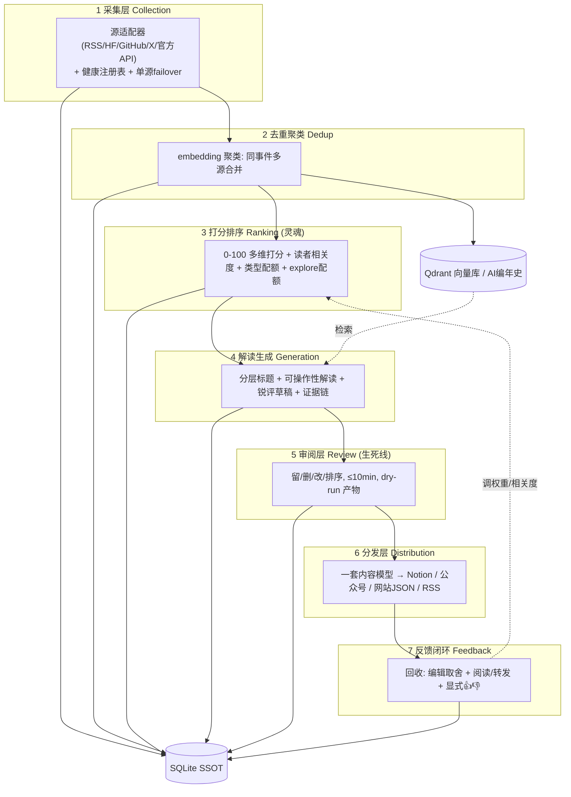
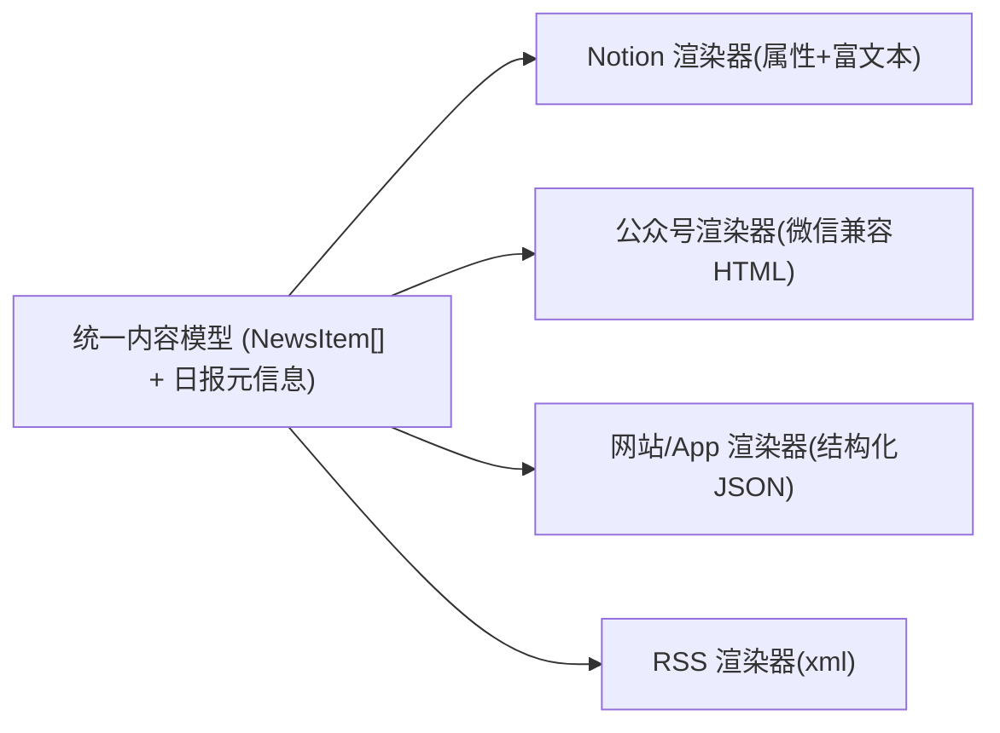

# 产品需求文档 (PRD) - AI News Daily

| 项目 | 内容说明 |
| --- | --- |
| 产品名称 | AI News Daily（每日 AI 新闻摘要） |
| 当前版本 | **V3.0.0**（迭代自 V2.0.0） |
| 文档状态 | Draft |
| 负责人 | CaFeChe / Faych Chen（PM / 技术负责人） |
| 关键利害关系人 | 终端读者（AI 研究者/工程师/PM）、内容审阅者（即作者本人）、下游渠道（公众号/社群/主站） |

## V3 修订记录（相对 V2 的核心变更）

> 本版的底层判断：**日报做不稳定，90% 不是技术问题，而是流程边际成本太高 + 没有反馈循环。** V3 的每一项变更都服务于一条生死线——**每天人工介入 ≤ 10 分钟，且只做"取舍"不做"重写"。**

1. **【方向级】从"全自动零编辑"→"半自动 + 审阅层"**：V2 定位"完全自动化、零编辑成本"，实践中要么质量不可控、要么坚持不下来。V3 引入显式**审阅层**（10 分钟内完成留/删/改/排序），并把审阅动作回收为反馈信号。
2. **【架构级】SSOT 从 Notion → SQLite**：Notion 由"系统本体"降级为**输出渠道之一**。一套内容模型，多端渲染（Notion / 公众号 / 网站 JSON / RSS）。
3. **【新增 P1】反馈闭环**：V2 只有埋点、无闭环。V3 把"读者行为 + 编辑取舍"喂回打分模型，形成可自学习的正循环（轻量实现，非 Milvus/Airflow）。
4. **【新增】沉淀层 / AI 编年史**：每日事件聚类后进向量库长期归档，可检索——把日报从"快消品"变成主站的核心资产。
5. **【升级】打分模型加两维**：在 V2 的 0-100 基础上，新增**读者相关度**（个性化）与 **explore 配额**（防信息茧房）。
6. **【升级】解读层 + 质量护栏**：从"<120 字摘要"升级为"分层呈现 + 可操作性解读 + 锐评"，并引入轻量证据链与自检（防 AI 味、防事实不实）。

---

## 一、产品定义与核心价值

### 1.1 一句话定义

为 **中文 AI 从业者**提供 **一手、经评分筛选、带人工锐评的每日 AI 资讯**，一套内容**多端分发**（Notion/公众号/网站/RSS），并通过**反馈闭环持续自学习、沉淀为可检索的 AI 编年史**的半自动内容流水线。

### 1.2 目标用户与分层（V3 明确）

- **主要受众（先抓住的一类）**：AI 研究者 / ML 工程师 / 技术型 PM —— 要一手、要能上手的东西、排斥二手搬运。
- **次要受众**：关注 AI 的开发者与技术爱好者（泛科技，要"有谈资的大新闻"）。
- **设计取舍**：以"主要受众"为锚定义信息密度与选题口径；用**分层呈现**（见 5.2）同时兼顾次要受众，而不是做三个版本。

### 1.3 核心价值与护城河

- **选得准 > 写得好**：日报质量的上限由**排序**决定，不由文笔决定。打分层是灵魂（见 4.3）。
- **锐评是护城河**：纯聚合谁都能做，**人写的判断与态度**别人抄不走，也是把社群流量导回主站、建立品牌的关键。
- **沉淀是资产**：可检索的 AI 编年史是主站最硬的长期资产。

### 1.4 用户故事

- 作为 AI 工程师，我想每天 3 分钟扫完、需要时一键展开深读，**且每条都告诉我"这对我意味着什么"**，而不是流水账标题党。
- 作为作者，我想每天 **≤ 10 分钟**完成审阅（留/删/改/排序）即可发布到全渠道，而不是每天重新创作一篇。
- 作为运营者，我想让系统**越用越懂受众**，并能随时检索"过去半年关于 X 的所有进展"。

---

## 二、开发排程与优先级

> 原则：MVP 先打通"采集→打分→解读→**审阅**→单渠道发布"的最短可持续闭环，再补反馈与多端。

| 阶段 | 优先级 | 功能 | 说明 | 状态 |
| --- | --- | --- | --- | --- |
| P0 | Must | 源采集引擎（adapter + 健康注册表 + failover） | 继承 V2，强化单源失效不阻断 | 继承/强化 |
| P0 | Must | 去重聚类（向量） | 同事件多源合并 | 继承/迁移到 Qdrant |
| P0 | Must | 打分排序 v1（0-100 多维） | 见 4.3，先不含个性化维度 | 升级 |
| P0 | Must | 解读生成（分层 + 锐评草稿） | 见 5.2 | **新增** |
| P0 | Must | **审阅层（留/删/改/排序，dry-run）** | 生死线，见 5.3 | **新增** |
| P0 | Must | 单渠道发布（Notion 或 Markdown） | 打通最短闭环 | 继承 |
| P1 | High | **反馈闭环 v1** | 回收审阅取舍 + 阅读行为 → 调打分 | **新增** |
| P1 | High | 多端发布适配器（公众号/网站 JSON/RSS） | 一稿多渲染 | **新增** |
| P1 | High | 沉淀层 / 向量归档 + 检索 | AI 编年史 | **新增** |
| P1 | High | 个性化维度（读者相关度）+ explore 配额 | 打分 v2 | **新增** |
| P2 | Mid | GitHub Actions 每日 cron + 可观察运行面板 | 自动化 + dry-run 复盘 | 部分继承 |
| P2 | Mid | 质量自检 pass（格式锁 + 证据链校验） | 见 4.4 | **新增** |
| P3 | Low | Web Dashboard（源/阈值/历史回看可视化） | 产品化 | 规划 |
| P3 | Low | 播客脚本 / 分享卡 / 视频脚本等衍生形态 | 借 justlovemaki/geekjourneyx | 规划 |

### 2.1 MVP 范围与验收标准（Definition of Done）

**MVP = P0 七步最短闭环跑通**：采集 → 去重 → 打分 → 解读 → 审阅 → 单渠道发布。下列 11 条**全部满足**才算 MVP 完成；每条都可测、有阈值。

| # | 验收项 | 通过标准（可测） |
| --- | --- | --- |
| 1 | 端到端可跑 | 一条命令 / 一次 cron 从采集走到 **dry-run 产物**，前 4 层全自动无人工干预 |
| 2 | 采集鲁棒 | 任一单源失败**不阻断**全链；run 日志记录失败源；≥ 10 个源稳定可用 |
| 3 | 去重正确 | 同事件多源合并；**去重覆盖率 100%**（由 golden 测试断言，无重复事件入选） |
| 4 | 打分可解释 | 每条带 `score_breakdown`；**配额生效**（输出条目数与类型 100% 符合 config 配额） |
| 5 | 解读零幻觉 | "今日必读"每条含 `takeaway` + `evidence`（原文锚点齐全）；**无证据条目不得入必读**；LLM 失败回退抽取式，人工抽检 **0 条编造事实** |
| 6 | 审阅生死线 | 审阅页支持留/删/改/排序；**单期审阅 ≤ 10 分钟**（连续 5 期实测均达标） |
| 7 | 发布成功 | 审阅通过后发布到 **≥ 1 个渠道**（Notion 或 Markdown）；**发布成功率 ≥ 95%** |
| 8 | 静默正确 | 时间窗内无合格条目时输出 `[SILENT]`，**不产出空日报、不误发** |
| 9 | 可观察 | 每次运行有 `runs` 记录（步骤/耗时/错误/产物路径），可复盘"今天为什么是这几条" |
| 10 | 测试绿 | `contract` + `golden` + `snapshot` 在 CI 全绿才允许发布 |
| 11 | **可持续性（最关键）** | **连续 7 天每天产出并发布，且每天审阅 ≤ 10 分钟** —— 这条是 MVP 真正的成败线 |

**MVP 明确不做（Out of Scope，属 P1+）**：反馈闭环、多端分发、个性化打分（reader_relevance 权重为 0）、沉淀检索、Web Dashboard、衍生形态（播客/卡片）。**先把最短闭环跑稳，再加花活。**

---

## 三、业务架构与逻辑

### 3.1 七层流水线（功能心智图）



### 3.2 数据模型（NewsItem，相对 V2 的增量）

保留 V2 的 `id/title/title_en/summary/link/source/source_type/published_at/tags/image_url/score/upvotes/related_links`，**V3 新增**：

| 字段 | 类型 | 说明 |
| --- | --- | --- |
| `cluster_id` | String | 所属事件聚类 ID（去重产物） |
| `score_breakdown` | JSON | 各打分维度明细（可解释、可调参） |
| `reader_relevance` | Float | 读者相关度（来自反馈/画像，0-1） |
| `is_explore` | Bool | 是否占用 explore 配额（多样性名额） |
| `takeaway` | String | "对你意味着什么 / 怎么用"（可操作性） |
| `hot_take` | String | 锐评（人写或人审，硬约束：无 AI 味） |
| `evidence` | JSON | 关键事实 → 原文锚点（证据链） |
| `review_action` | Enum | keep / drop / edit（**编辑取舍 = 隐式反馈**） |
| `outcome` | JSON | 发布后回收：open/dwell/forward/upvote |
| `embedding_id` | String | Qdrant 中向量引用 |

新增表：`runs`（每次运行的步骤/耗时/错误/dry-run 产物路径）、`sources`（健康注册表，继承 V2 并增 `quality_weight`）、`feedback`（行为事件流）。

### 3.3 流程（Happy Path）

```
[cron/手动触发]
  → 加载源注册表(失败→硬编码备选)
  → 并行采集(单源失败标记failed, 非致命)
  → 归一化 + 时间窗过滤(24h, 最多36h)
  → embedding → 向量去重聚类 → 写 Qdrant 归档
  → 打分(多维 + 读者相关度) → 类型配额 + explore配额筛选
  → 解读生成(分层标题/takeaway/锐评草稿/证据链)
  → 产出 dry-run 产物(JSON + 预览)
  → [人工审阅 ≤10min: 留/删/改/排序] ← 记录 review_action
  → 多端渲染发布(Notion/公众号/网站/RSS)
  → 回收 outcome(异步) → 反馈闭环 → 调打分权重
```

### 3.4 异常路径（继承 V2 + 新增）

| 异常 | 处理 |
| --- | --- |
| 单源 403/404 | 标 failed，继续其他源，记 run 日志（非致命） |
| 时间窗内无条目 | 输出 `[SILENT]`，不进入审阅/发布 |
| LLM 解读失败 | 回退到"抽取式摘要"，标记需人工补写，**绝不发幻觉内容** |
| 某渠道发布失败 | 其他渠道照常；失败渠道留 dry-run 产物供手动补发 |
| 审阅未在窗口内完成 | 进入"待审"队列，不自动发（半自动原则） |
| 证据链缺失（无原文锚点） | 该条降级/打回，不进入"今日必读" |

---

## 四、关键算法与规则

### 4.1 去重聚类

- 对归一化后的条目取 embedding，按相似度阈值聚为 `cluster`；同 cluster 内保留信息最全/最一手的一条为主条目，其余进 `related_links`。
- 聚类同时写入 Qdrant 长期归档（沉淀层基础）。

### 4.2 类型配额（继承 V2，参数化）

保留 V2 的 paper/model/tool/community/official/news 配额（≈7 条），**V3 改为可配置**，并叠加 explore 配额（见 4.3）。

### 4.3 打分模型 v2（V3 升级）

**维度（0-100）= 基础分 + 可见指标 + 时效 − 惩罚 + 读者相关度调节**

- 基础分（继承 V2）：机构影响力 / 一手性 / 技术价值 / 产业影响 / 扩散潜力。
- 可见指标（继承 V2）：HF upvotes / Models likes / GitHub stars 分段加分。
- 时效（继承 V2）：0-24h +10 … >72h stale penalty。
- 惩罚（继承 V2）：同源/同主题/过期。
- **【新增】读者相关度**：条目 embedding 与"读者画像向量 + 历史正反馈向量"的相似度，映射为 ±N 分。冷启动时该项权重为 0，随反馈累积逐步提权。
- **【新增】explore 配额**：每期固定保留 1-2 个名额给"高不确定性 / 高多样性"条目（不按相关度排序选出），**防止越优化越媚俗、陷入信息茧房**（这是借鉴 RLHF 同时规避其坑的关键设计）。

> 全部维度写入 `score_breakdown`，**可解释、可在配置文件里调权重**，不写死在代码里。

### 4.4 解读层 + 质量护栏（V3 新增）

- **分层呈现**：每条产出"一句话扫读标题（中文）"+"可展开解读"。
- **可操作性**：解读不止"为什么重要"，对从业者要落到"**对你意味着什么 / 能怎么用**"。
- **锐评（hot_take）**：硬约束写进编辑规范（见附件）——无 AI 味、保留作者 style、有判断有态度；可 AI 起草、人工定稿。
- **证据链**：解读中的关键事实必须能映射回原文锚点（`evidence`）；**无证据的条目不得进"今日必读"**。
- **生成纪律**：先抽取事实、再成文，降低幻觉；LLM 失败一律回退抽取式，**宁可少写不可编造**。

### 4.5 反馈闭环 v1（V3 新增）

- **信号源**：① 编辑 `review_action`（留/删/改 = 最强隐式信号）；② 阅读行为（open/dwell/forward/收藏）；③ 显式 👍👎。
- **存储**：事件进 `feedback` 表 + 正反馈条目向量进 Qdrant。
- **应用**：周期性重算 `reader_relevance` 与各 `source.quality_weight`；按 explore/exploit 比例选条。
- **护栏**：保留 explore 配额 + 类型多样性约束，避免单一化。

---

## 五、交互与输出

### 5.1 内容模型 → 多端渲染（一稿多渲染）



### 5.2 日报结构（分层）

- **今日看点**：3-5 句宏观趋势。
- **今日必读（Top 3）**：中英双语标题 + 解读 + takeaway + 锐评 + 证据链。
- **分类速览**：按类型分组，每条一句话标题 + 评分 + 可展开解读。
- **数据概览**（可选）：分类分布 / 高频关键词。

### 5.3 审阅层（生死线，V3 核心新增）

- **形态（MVP）**：本地极简 Web 页读取 dry-run JSON，每条仅四个操作：**留 / 删 / 改 / 拖动排序**。
- **目标**：≤ 10 分钟完成取舍与点睛即可一键发布全渠道。
- **纪律**：审阅做得越轻，日报活得越久；**审阅动作全部回收为反馈信号**。

### 5.4 Notion 属性（继承 V2）

保留 V2 的 `Name/Date/TotalItems/Quality/Tags/Pipeline/TimeWindow/SourceDiversityScore/DedupApplied`，新增 `ExploreCount`、`AvgReaderRelevance`。

### 5.5 单条 Item 模板（NewsItem，作为渲染器与解读层的契约）

```jsonc
{
  "id": "uuid",
  "cluster_id": "evt-2026-05-30-001",     // 去重聚类 ID
  "source_type": "model",                  // paper|model|tool|community|official|news
  "title": "智谱发布 GLM-5，开源 MoE 旗舰",   // 中文标题 ≤64 字
  "title_en": "Zhipu releases GLM-5 ...",  // 原始英文标题(链接文字保留)
  "link": "https://huggingface.co/...",
  "source": "Hugging Face Models",
  "published_at": "2026-05-30T08:00:00Z",
  "score": 88,
  "score_breakdown": {                     // 可解释、可调权重
    "机构影响力": 18, "一手性": 20, "技术价值": 14,
    "产业影响": 9, "扩散潜力": 8, "可见指标": 12,
    "时效": 10, "惩罚": -3, "读者相关度": 0  // MVP 阶段为 0
  },
  "reader_relevance": 0.0,
  "is_explore": false,
  "tags": ["#开源模型", "#MoE", "#GLM"],     // 恰好 3 个
  "summary": "GLM-5 采用 MoE 架构，开源权重，主打长上下文与低推理成本……", // ≤120 字
  "takeaway": "想自建推理服务的团队，这是当前性价比最高的开源选项之一，可直接替换 X。", // 对你意味着什么/怎么用
  "hot_take": "开源 MoE 终于卷到推理成本，闭源厂商的定价护城河又薄了一层。", // 锐评(人写/人审, 无AI味)
  "evidence": [                            // 证据链:关键事实→原文锚点
    { "claim": "MoE 架构、开源权重", "anchor": "https://huggingface.co/...#model-card" }
  ],
  "image_url": null,
  "related_links": ["https://...(同事件其他来源)"],
  "review_action": "keep",                 // keep|drop|edit (= 隐式反馈)
  "outcome": {}                            // 发布后回收:open/dwell/forward/upvote
}
```

> 字段纪律：`hot_take`/`takeaway` 可由 LLM 起草、**人工定稿**；`evidence` 缺失则该条不得进"今日必读"（见 4.4）。

### 5.6 整份日报模板（渲染输出，对应 5.2 结构）

```markdown
# AI Daily · 2026-05-30（周六）

> **今日看点**：开源 MoE 把推理成本又压低一截；多模态 Agent 从 demo 走向可用；
> 监管侧出现首个针对训练数据来源的合规草案。共 7 条，含 1 条探索性选题。

## 🏆 今日必读

### 1. [模型] 智谱发布 GLM-5，开源 MoE 旗舰（GLM-5）
- **一句话**：开源 MoE 旗舰，主打长上下文 + 低推理成本
- **解读**：是什么——首个开源权重的 MoE 旗舰；为什么重要——把闭源的成本优势拉平
- **对你**：自建推理服务的团队可直接评估替换，性价比当前最高之一
- **锐评**：闭源厂商的定价护城河又薄了一层
- **评分**：88 ｜ **来源**：[HF Models](https://...) ｜ 2 小时前
- **依据**：MoE 架构、开源权重 → [模型卡](https://...#model-card)

### 2. [论文] ……
### 3. [官方] ……

## 📚 分类速览

**论文**
- `[82]` <标题> — <一句话>（▸ 展开解读）｜[arXiv](https://...)
**工具 / 开源**
- `[76]` <标题> — <一句话>（▸ 展开解读）｜[GitHub](https://...)
**社区**
- `[71] 🧭探索` <标题> — <一句话>｜[HN](https://...)   ← explore 名额

## 📊 数据概览
- 分类分布：论文 2 ｜ 模型 1 ｜ 工具 2 ｜ 官方 1 ｜ 社区 1
- 高频关键词：MoE、Agent、推理成本、多模态

---
📬 [RSS 订阅](https://...) ｜ 🗂 [历史归档](https://...) ｜ 🏠 [主站](https://...)
```

> 同一份 `NewsItem[]` + 日报元信息，经不同渲染器产出 Notion / 公众号 HTML / 网站 JSON / RSS（见 5.1），**内容只审一次，多端一致**。

---

## 六、成功指标与埋点

### 6.1 北极星指标（V3 重定义）

> V2 的指标偏"系统是否跑通"，V3 增加"是否真被读、是否越来越准、是否可持续"。

| 指标 | 目标 | 说明 |
| --- | --- | --- |
| **审阅耗时** | ≤ 10 min/期 | 生死线指标，最重要 |
| 发布成功率（全渠道） | ≥ 95% | 自动化稳定性 |
| 完读率 × 获得感 | 持续上升 | 留存真函数（见正文 1.3） |
| 反馈采纳率 | 反馈使打分排序更贴近编辑取舍 | 闭环是否生效（编辑 drop 率应随时间下降） |
| 来源多样性得分 | ≥ 60 | 防茧房 |
| 平均条目质量分 | ≥ 70 | 内容上限 |
| 去重覆盖率 | 100% | 无重复事件 |

### 6.2 埋点（继承 V2 + 新增）

继承 `pipeline_start / source_fetch_success|fail / dedup_cluster_created / item_selected / publish_success|fail`，**新增**：`review_action`（item_id, action, dwell_ms）、`item_outcome`（open/dwell/forward/upvote）、`feedback_applied`（重算前后权重 diff）、`explore_item_performance`（explore 名额的实际表现，用于校准 explore 比例）。

---

## 七、附件

1. **编辑规范**（`skills/references/editorial-guideline.md`）：锐评 style、无 AI 味硬约束、术语保留英文、标题翻译规则、可操作性写法、证据链要求。
2. **打分细则**（`skills/references/scoring-rubric.md`）：各维度定义与权重（可调）、explore 配额规则。
3. **源注册表**（`skills/references/sources-registry.md`）：源 + 类型 + 状态 + 优先级 + quality_weight。
4. **架构决策记录**（`docs/adr/`）：语言/向量库/编排/部署等关键选择的理由。

> 上述 1-3 是**沉淀进仓库的 SOP**——把"编辑判断与选题规则"从脑子里搬进版本化文件，是本项目能否长期稳定（不重蹈"核心在个人脑中、不可持续"覆辙）的关键前提。开发协作方式见配套文档《Claude Code 开发范式》。
