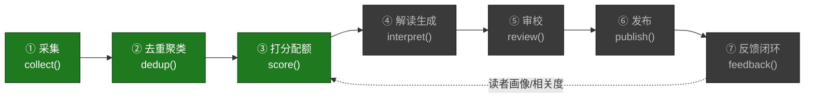
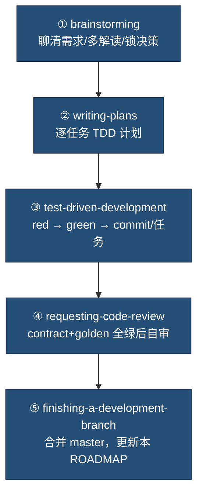
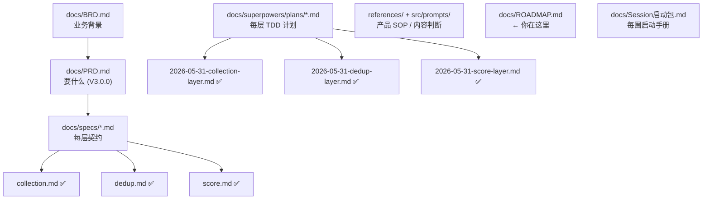

# ROADMAP — 开发进度与文档地图

> 本文是项目的**可视化进度看板** + **文档导航** + **每圈开发范式**。
> 每完成一个 Circle 更新此文。最后更新：2026-05-31（Circle 3 score 已合并）。

---

## 1. 七层流水线 · 全景

图例：🟩 已实现并合并 · 🟨 已写 spec / 进行中 · ⬜ 待开始

---

## 2. 进度表

| # | 层 | spec | 实现 | 测试 | dry-run | 状态 |
|---|---|---|---|---|---|---|
| ① | 采集 collect | `specs/collection.md` | ✅ `pipeline/collect.py` + 3 adapters | ✅ 26 绿 | ✅ 28 源实跑 | **🟩 已合并 (master)** |
| ② | 去重聚类 dedup | `specs/dedup.md` | ✅ `pipeline/dedup.py` + embedding/vectorstore adapters | ✅ 34 绿 | ✅ `--dry-run --dedup` 实跑 | **🟩 已合并 (master)** |
| ③ | 打分配额 score | `specs/score.md` | ✅ `pipeline/score.py`（纯打分+配额） | ✅ golden | ✅ `--dry-run --score` 实跑 | **🟩 已合并 (master)** |
| ④ | 解读生成 interpret | — | — | — | — | ⬜ |
| ⑤ | 审校 review | — | — | — | — | ⬜ |
| ⑥ | 发布 publish | — | — | — | — | ⬜ |
| ⑦ | 反馈闭环 feedback | — | — | — | — | ⬜ |

---

## 3. 每圈开发范式（superpowers 链）

> 对应你提的"每次迭代的开发范式 skill"。本项目每个 Circle **固定走这 5 步**，每步对应一个 superpowers skill。

| 步 | skill | 产物 | 门槛 |
|---|---|---|---|
| ① 想清 | `superpowers:brainstorming` | spec (`docs/specs/<层>.md`) | 你确认设计 |
| ② 定计划 | `superpowers:writing-plans` | 计划 (`docs/superpowers/plans/<日期>-<层>.md`) | 逐任务可验收 |
| ③ 实现 | `superpowers:test-driven-development` | 代码 + 测试 | 先写失败测试再写实现 |
| ④ 审查 | `superpowers:requesting-code-review` | 评审意见 | contract+golden 全绿 |
| ⑤ 收尾 | `superpowers:finishing-a-development-branch` | 合并 + 进度更新 | 验收对齐 PRD §2.1 |

> 纪律（CLAUDE.md）：一次只做一层、不横跨；没有失败测试不写实现；对外副作用必须支持 `--dry-run`。

---

## 4. 文档地图

| 文档 | 作用 |
|---|---|
| `docs/PRD.md` | 产品需求（V3.0.0），每层验收标准源头 |
| `docs/BRD.md` | 业务背景 |
| `docs/specs/<层>.md` | 每层契约（接口/数据/算法/不变量/golden 用例） |
| `docs/superpowers/plans/<日期>-<层>.md` | 每层逐任务 TDD 计划 |
| `docs/Session启动包.md` | 每圈开发启动手册（范式见本文 §3） |
| `docs/ROADMAP.md` | **本文** — 进度看板 + 文档导航 |

---

## 5. 下一步（Circle 4 · interpret）

1. **你 review** 即将产出的 `docs/specs/interpret.md`（解读生成契约，验收门 = 结构化 JSON + 证据链可复现）。
2. 确认后 → `superpowers:writing-plans` 产出 interpret 的逐任务 TDD 计划。
3. 按计划 TDD 实现：`interpret()` 消费本层入选高分主条目，LLM(Sonnet) 走 provider 适配器；结构化 JSON 输出 + schema 校验，解析失败回退抽取式（宁可少写不可编造）。
4. 收尾合并，回来更新本表 ④→🟩。

### 已完成（Circle 3 · score）
- `compute_scores()` / `apply_quota()` 纯函数（多维 breakdown 9 键，registry 优先级折进"机构影响力"；类型配额严格按类型不跨类型补位）+ `score()` orchestrator（emit score 事件）。
- 权重/配额全读 `config/scoring.yaml`（recency/penalty 拍平），不写死；冻结 fixtures 驱动 6 个 golden 用例（配额裁剪/未满全留/时效档/同源惩罚/空输入静默/clamp+breakdown 求和+确定性）。
- 验收门 PRD #4 配额生效 100% 通过；`--dry-run --score`（collect→dedup→score）链路实跑。

### 已完成（Circle 2 · dedup）
- `cluster()` 纯函数（贪心阈值聚类，registry 优先级注入）+ `EmbeddingProvider`(ModelScope)/`VectorStore`(InMemory，Qdrant 后置) 适配器。
- `FakeEmbeddingProvider` 冻结向量驱动 6 个 golden 用例；embedding 失败降级为全单例（spec §7）。
- 验收门 PRD #3 去重覆盖率 100% 通过；`--dry-run --dedup` 链路实跑。

### 待办 backlog（采集层遗留，不阻塞 Circle 4）
- 修死链：`microsoft-ai` (403)、`meta-ai` (404) feed URL 过期。
- `hf-models` firehose 噪声大（topic-agnostic，过滤是 Circle 3 的职责）。
