# 竞品分析 — 开源 AI News/日报项目（BRD 用）

> 方法：13 个仓库逐个 `git clone --depth 1` 下来**实读源码**（README + 入口 + 取源/总结/发布模块），不依赖 DeepWiki 摘要（代码是 ground truth）。
> 日期：2026-06-24。所有结论标注了代码依据；无法从代码确定的标了"据 README/docs"。
> **`imjuya/juya-ai-daily` 无法访问（GitHub API 返回 404，仓库不存在/已删/改名）——本文不含该项。** 其余 12 个全部分析。

---

## 0. 一句话画像

| # | 项目 | 一句话 | 源数量级 | 栈 |
|---|---|---|---|---|
| 1 | JoeLeelyf/customize-arxiv-daily | 个性化 arXiv 论文推荐（prompt=你的研究兴趣） | 单源(arXiv) | Python |
| 2 | vigorX777/ai-daily-digest | Karpathy 的 90 个 HN 顶级博客 → AI 多维打分精选 | 单源类(博客) | TS/OpenCode skill |
| 3 | geekjourneyx/ai-daily-skill | 薄封装 smol.ai → Claude 分类美化 | 单源(smol.ai) | Python/CC skill |
| 4 | aichipera/github-trend | GitHub Trending 日/周/月 → AI 摘要 + 归档 | 单源(GH Trending) | Python+数据库 |
| 5 | liyedanpdx/reddit-ai-trends | Reddit AI 子版深挖 + 多模态 | 单源(Reddit) | Python |
| 6 | tuber0613/hot_news_daily_push | 广撒 RSS+平台热榜+Twitter → 去重总结推送 | 多源 | Python |
| 7 | finaldie/auto-news | 企业级个人内容 OS：多源→向量→Notion+App | 多源 | Python+Airflow+K8s |
| 8 | liyown/ai-trend-publish | 微信公众号自动出稿流水线（provider 抽象） | 多源 | TS/Deno+CF |
| 9 | justlovemaki/CloudFlare-AI-Insight-Daily | Serverless 聚合 → 日报+播客 | 多源 | CF Workers/JS |
| 10 | kevinho/clawfeed | SaaS 化多频率简报（4H/日/周/月） | 多源 | Node/TS |
| 11 | LearnPrompt/ai-news-radar | 源策略优先 + 健康度 + 故事线合并 | 多源 | Python+Agent Skill |
| 12 | The-Swarm/NewsAgent | swarms 多智能体 over NewsAPI（通用新闻） | 单源(NewsAPI) | Python/swarms |

---

## 1. JoeLeelyf/customize-arxiv-daily

**核心逻辑**（`arxiv_daily.py`）：`get_yesterday_arxiv_papers(category)` 按 arXiv 分类拉昨日论文 → 对每篇 `get_response(title, abstract)` 让 LLM 按**用户自定义描述 prompt** 打 0-10 relevance 分（JSON 输出，解析失败重试 5 次）→ 排序取高分 → 渲染 HTML → SMTP 邮件。

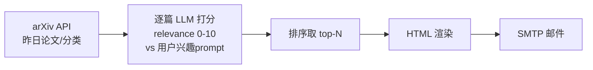

- **底层框架**：纯 Python 脚本 + cron/Action；LLM 走 Ollama/GPT/SiliconFlow 适配（`llm/`）。
- **产品思路**：个人 arXiv 订阅替代品（致敬 zotero-arxiv-daily），prompt 即偏好。
- **设计模式**：逐条 LLM 评分循环 + 解析重试；LLM provider 适配。
- **优势**：个性化 prompt 打分简单有效；本地 Ollama 可零成本。
- **缺点（避免）**：单源、无去重、无热度信号；逐篇 LLM 调用成本随论文数线性涨。

---

## 2. vigorX777/ai-daily-digest

**核心逻辑**（`scripts/digest.ts`）：内置 **90 个 RSS**（注释明写 "Hacker News Popularity Contest 2025, curated by Karpathy"，含 simonwillison/antirez/lcamtuf…）→ 拉 RSS → AI **多维评分**筛选 → 结构化日报。Gemini 主 + OpenAI 兼容降级。`/digest` 交互式。

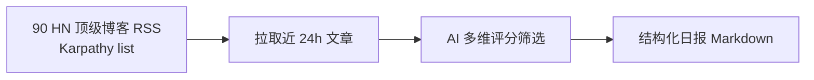

- **底层框架**：TypeScript，作为 **OpenCode Skill**；Gemini→OpenAI 降级。
- **产品思路**："高信号源池 + 多维打分"，对标"少而精"。
- **设计模式**：硬编码精选源 + LLM 评分；skill 交互引导。
- **优势**：源池质量高（与**我们的 `references/hn-popular-blogs-2025.opml` 同源**）；多维评分。
- **缺点**：源固定在技术博客、非 AI 产品/发布；无社媒、无热度信号。

> 注：这是和我们 `references/` 用同一份 HN-popularity 源清单的项目，可直接对照打分维度。

---

## 3. geekjourneyx/ai-daily-skill

**核心逻辑**（`src/config.py`/`claude_analyzer.py`）：**单源 = `https://news.smol.ai/rss.xml`**（`RSS_URL` 默认值）→ Claude（走 `open.bigmodel.cn/api/anthropic`，即 GLM 的 anthropic 兼容端点）`_build_prompt` 出 summary+categories → Markdown + 可选 HTML（多主题）+ 小红书卡片图（`xiaohongshu_generator`、fireflycard API）。

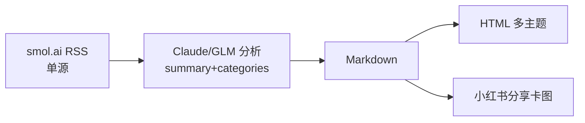

- **底层框架**：Python，**Claude Code Skill**（`.claude-plugin/`）。
- **产品思路**：站在 smol.ai 肩膀上做"中文化 + 美化 + 社媒卡片"。
- **设计模式**：单源适配 + LLM 格式化 + 多渲染器（HTML/小红书图）。
- **优势**：极简、出图好看、适合公众号/小红书分发；fallback 分类。
- **缺点（避免）**：**完全依赖 smol.ai 一个上游**——上游挂/改格式就全断；无自有信号。

---

## 4. aichipera/github-trend

**核心逻辑**：定时抓 **GitHub Trending**（日/周/月榜）→ AI 分析摘要 → 按 `daily/ weekly/ monthly/` 目录归档（仓库 867 文件多为存量数据）→ `generate_index.py` 生成 HTML 索引 → 公众号。还分 `ai/ riscv/ linux/ semitech/` 垂类。

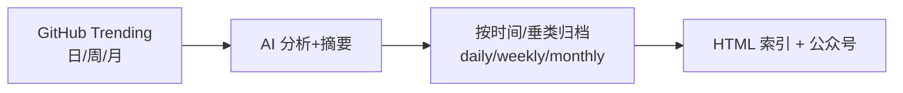

- **底层框架**：Python + GitHub Actions（爬取/分析逻辑主要在 Action 内，仓库以归档产物为主）。
- **产品思路**：GitHub 技术趋势观察站 + 垂类（RISC-V/Linux/AI）。
- **设计模式**：单源 + 时间分桶归档 + 静态站。
- **优势**：趋势纵向归档（可看长期演化）；垂类切分。
- **缺点**：单源(GH Trending) 且**和我们刚修的一样会被绝对 star 老项目霸榜**（无 created 过滤则同病）；纯技术 repo、非 AI 资讯全景。

---

## 5. liyedanpdx/reddit-ai-trends

**核心逻辑**（`services/reddit_collection/client.py`）：用 **PRAW（Reddit 官方 OAuth API**，`client_id/secret/user_agent`）取各 AI 子版 `top(time_filter)`/`hot` → **多模态富化**：图片(Qwen-VL/Gemini)、YouTube 字幕、Firecrawl 网页抓取、评论(过滤 bot) → LLM 出双语趋势报告 → MongoDB + GitHub。

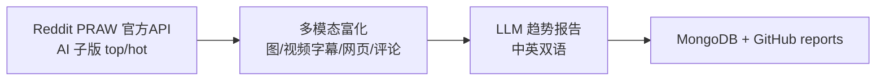

- **底层框架**：Python + MongoDB + Docker；PRAW；Firecrawl；多 LLM(OpenRouter/Gemini)。
- **产品思路**：Reddit 社区脉搏专精 + 多模态把帖子读"全"。
- **设计模式**：官方 API 客户端 + 多模态 analyzer 流水线 + 双语。
- **优势**：**正经走 Reddit OAuth（不爬 HTML，不吃 403）**——直接对照我们的 Reddit 403 痛点；多模态最强。
- **缺点**：单源(Reddit)；多模态成本高；需 Reddit app 凭证。

> 关键对照：**我们 Reddit 在 prod 403、yield=0；它用 PRAW OAuth 正常工作。** 这是我们 Reddit 源的现成解法。

---

## 6. tuber0613/hot_news_daily_push

**核心逻辑**（`config/config.py`）：广撒 RSS（OpenAI/机器之心/极客公园/DeepMind/量子位/InfoQ/MarkTechPost/Meta/VentureBeat/AI-news…）+ Twitter feed（`rsshub.app/twitter/user/*`，**代码里整段注释掉了**——RSSHub twitter 已不可靠）+ 平台热榜 → `crawl4ai` 处理 JS 站 → 去重 → LLM 总结(deepseek/hunyuan/gemini) → 多渠道 webhook 推送（按 UTF-8 字节 4096 分块）。

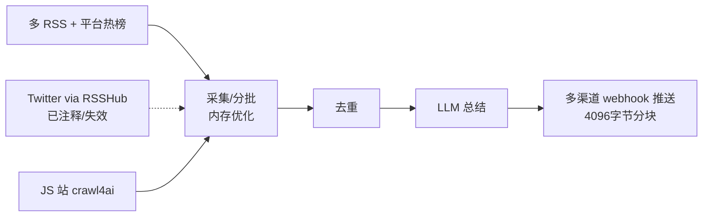

- **底层框架**：Python（Cursor/Trae 接力写）；crawl4ai；deepseek/hunyuan/gemini。
- **产品思路**：广覆盖中文+英文资讯 + 多群推送。
- **设计模式**：源配置表 + 分批采集（内存优化）+ 多 LLM 适配 + webhook 分块。
- **优势**：中文源全（量子位/机器之心/极客公园/InfoQ）；JS 站兜底；工程化内存治理。
- **缺点（避免）**：**Twitter 整段注释=承认 RSSHub twitter 不可用**（印证我们的判断）；广撒易噪。

---

## 7. finaldie/auto-news

**核心逻辑**（`src/af_pull.py` + `dags/news_pulling.py`）：**Airflow DAG** 编排，`OperatorTwitter/Youtube/RSS/Reddit/Article` 各自 pull（从用户 inbox/saved）→ 向量库（ChromaDB/Milvus）做 embedding 去重/语义 → LLM(ChatGPT/Gemini/Ollama) 总结/去重/排序 → **Notion**（+ Obsidian 模板）→ 移动 App（Dots Agent，App Store/Play 上架）。

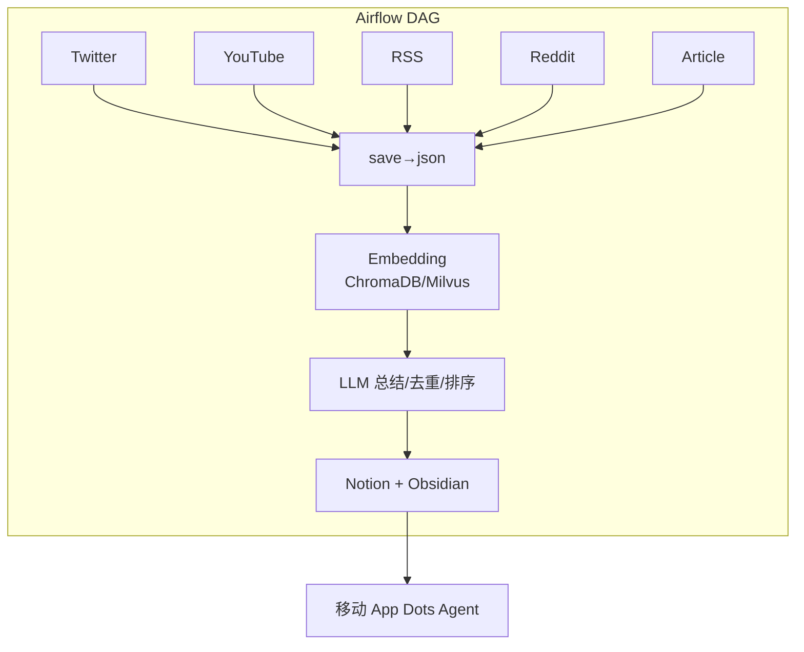

- **底层框架**：Python + **Airflow + Kubernetes/Helm/ArgoCD** + 向量库(Chroma/Milvus)。
- **产品思路**：不止日报——**个人内容操作系统**（收件箱→知识库→App），商业化(App 内购)。
- **设计模式**：DAG 编排 + Operator 抽象 + 向量语义层 + Notion 为中枢。
- **优势**：多源 + 语义去重 + 知识沉淀 + 已商业化 App；工程最完整。
- **缺点（避免）**：**重得离谱**（K8s/Airflow/向量库三件套），个人日报场景过度工程；上手门槛高。

---

## 8. liyown/ai-trend-publish

**核心逻辑**（`trendpublish.config.example.ts` + `src/integrations/fetch/`）：源按 **URL 路由 provider**——`x.com/twitter.com → TwitterScraper`、`RSS/RSSHub(rsshub.app) → rss`、普通网页 `→ FireCrawl/Jina`（`scraper-registry.ts`、`fetch-provider-registry.ts`）。AI 流水线：**选题→证据补全→排序→标题→正文→审稿→排版→配图**（`weixin-article/`）→ 微信公众号草稿（dry-run 预览）。Dashboard 可编辑源/方案/定时。

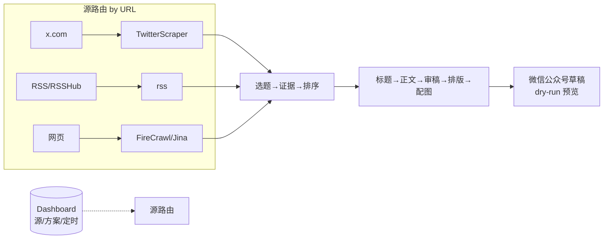

- **底层框架**：TypeScript/Deno + Cloudflare/Docker；provider 注册表；多 LLM(deepseek…)。
- **产品思路**：**和我们最像**——可观察、可回滚、可调参的公众号出稿流水线（每步留痕）。
- **设计模式**：**provider/adapter 抽象（源/LLM/抓取可换）**、scraper 注册表、URL→provider 推断、dry-run、Dashboard 配置热生效。
- **优势**：架构最对标我们；Twitter+RSSHub+FireCrawl 三路兜 X/网页；可视化配置。
- **缺点**：聚焦"出一篇公众号文"，不是"全景日报候选池"；TwitterScraper 稳定性依赖第三方。

---

## 9. justlovemaki/CloudFlare-AI-Insight-Daily

**核心逻辑**（`src/dataFetchers.js` + `dataSources/`）：分类源 `news/projects(GitHubTrending)/papers/twitter`；**Twitter 走 Folo**（`dataSources/twitter.js`：带 `x-app-name: Folo Web` + 用户 `foloCookie` 调 Folo API 读 X 条目）→ Gemini 摘要 → GitHub Pages（Hugo/Hextra）+ **播客 TTS 音频**。后端已迁移到 PrismFlowAgent。

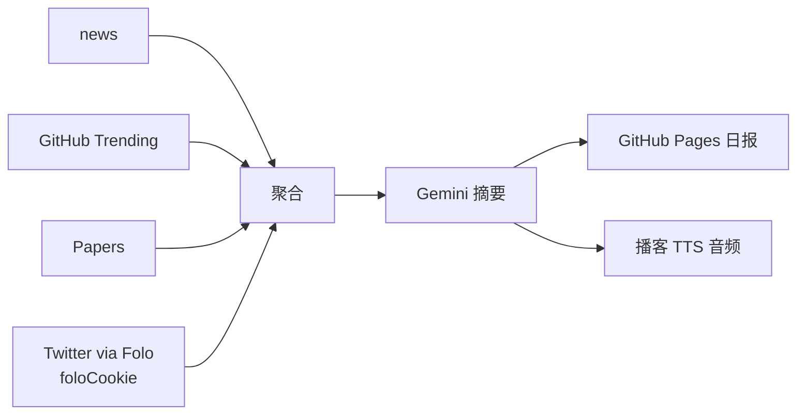

- **底层框架**：**Cloudflare Workers**（纯 serverless）+ Gemini；Folo 作 X 桥。
- **产品思路**：零服务器日报 + **播客**（差异化输出形态）。
- **设计模式**：dataSource 适配器 + `Promise.allSettled` 并发容错 + Folo cookie 桥接社媒。
- **优势**：**Folo cookie 读 X**（不碰付费 API，借第三方聚合器的用户会话）——直接对照我们的 X 缺口；播客形态差异化；serverless 零运维。
- **缺点**：依赖用户 Folo 账号 cookie（会过期）；Gemini 单点。

> 关键对照：**Folo（folo.is，开源 RSS 阅读器/聚合器）+ 用户 cookie = 免费读 X 的一条路。**

---

## 10. kevinho/clawfeed

**核心逻辑**（`docs/PRODUCT.md`/`ARCHITECTURE.md`，src 为打包 .mjs）：源含 **Twitter For-You feed + Twitter Bookmarks**（`twitter_feed`=算法时间线、`twitter_bookmarks`=用户收藏）、RSS、HN、Reddit、GitHub Trending → 多频率简报（**4H/日/周/月**）→ 结构化摘要 + **Mark & Deep Dive**（收藏→AI 深挖）→ Web Dashboard。**Source Packs**（可分享的源包）。可作 OpenClaw/Zylos skill。

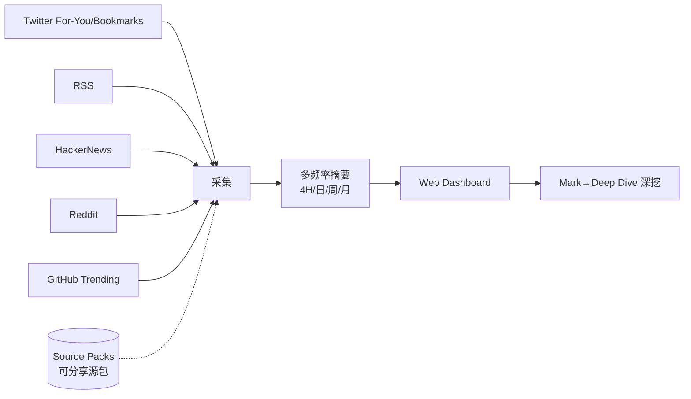

- **底层框架**：Node/TypeScript（bundled）+ Docker；OpenClaw/Zylos skill。
- **产品思路**：SaaS 化"信息简报工具"，社区可共享 Source Packs。
- **设计模式**：源插件 + 多频率聚合 + 收藏深挖 + 源包分享（生态）。
- **优势**：**4H 高频** + 用户自己的 Twitter 时间线/收藏（绕开 API，用本人会话）+ Source Packs 生态 + Deep Dive。
- **缺点**：Twitter 靠用户本人会话（不可托管/规模化）；闭源打包、可借鉴度有限。

---

## 11. LearnPrompt/ai-news-radar

**核心逻辑**（`docs/SOURCE_COVERAGE.md` + `scripts/`）：**OPML 源**（official RSS/Atom/JSON、changelog、**GitHub 生成的 X/blog/newsletter 聚合 feed**、newsletter 存档、secret-backed adapters）→ `ai_relevance.py`/`audit_ai_relevance.py` **AI 相关性审计** + `evaluate_source_overlap.py` 源重叠评估 → **故事线合并**（`stories-merged.json`）→ GitHub Pages **两层 UI**（Signal 默认层 / Advanced 高级层）+ **源健康监控**（`source-status.json`）。打包成 **Scout/伯乐 Skill**（"从一堆源里选千里马"）。

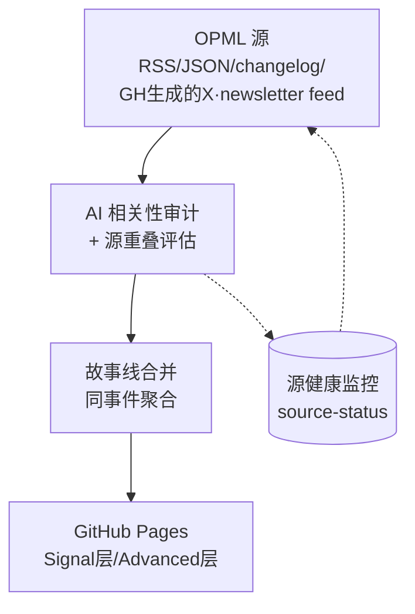

- **底层框架**：Python + GitHub Actions + Agent Skill（`skills/radar`、`skills/ai-news-radar`）。
- **产品思路**：**源策略优先**——明确"不做"私有收件箱/cookie/微信/原始社媒时间线（交高级层/私有 fork）；首屏只读健康度。**和我们理念最接近。**
- **设计模式**：OPML 配置 + 相关性审计 + 源重叠/健康度量 + 故事线合并 + 两层产品分层 + Skill 化。
- **优势**：**源健康 + AI 信号密度 + 故事线合并**（同事件去重成时间线）——我们没有的；产品分层克制。
- **缺点**：同样**回避原始 X/社媒**（GitHub 生成的 feed 二手）；故事线合并对 LLM 依赖。

---

## 12. The-Swarm-Corporation/NewsAgent

**核心逻辑**（`news_swarm/tool.py`/`main.py`）：用 **NewsAPI**（`newsapi.org`，`get_everything(q=...)`）取新闻 → **swarms 多智能体**框架查询/总结 → JSON 运行记录（`news_agent_runs/`）。示例是 `fetch_stock_news`（**通用新闻/股票，非 AI 专门**）。

- **底层框架**：Python + **swarms** 多智能体框架；NewsAPI（付费）。
- **产品思路**：企业级新闻 Agent 框架 demo（可嵌入 workflow）。
- **设计模式**：多智能体 + 工具(NewsAPI)调用。
- **优势**：多智能体框架可扩展；NewsAPI 覆盖广。
- **缺点（避免）**：**非 AI 垂直**（通用/金融示例）；依赖**付费 NewsAPI**；更像框架示例而非成品日报。

---

## 13. 总对比表

| 项目 | 核心逻辑 | 底层框架 | 产品思路 | 设计模式 | 独特优势 | 要避免的缺点 |
|---|---|---|---|---|---|---|
| customize-arxiv-daily | arXiv 逐篇 LLM 兴趣打分 | Python+多LLM | 个人 arXiv 订阅 | 评分循环+provider | prompt 个性化、Ollama 零成本 | 单源/无去重/无热度 |
| ai-daily-digest | 90 HN 博客→多维打分 | TS/OpenCode skill | 少而精 | 硬编码精选源+评分 | 高信号源池(同我们 HN-opml) | 仅技术博客/无社媒 |
| ai-daily-skill | smol.ai→Claude 美化 | Python/CC skill | 站上游肩膀+出图 | 单源+多渲染器 | 极简/小红书卡图 | 完全依赖单上游 |
| github-trend | GH Trending→AI 摘要归档 | Python+Actions | 趋势观察站+垂类 | 单源+时间分桶 | 长期归档/垂类 | 单源/老项目霸榜风险 |
| reddit-ai-trends | Reddit PRAW+多模态 | Python+Mongo | Reddit 脉搏专精 | 官方API+多模态 | **PRAW 正经 OAuth(不吃403)**/多模态 | 单源/成本高 |
| hot_news_daily_push | 广撒 RSS+热榜→推送 | Python+crawl4ai | 中英广覆盖多推 | 源表+分批+多LLM | 中文源全/JS兜底 | Twitter 失效/广撒噪 |
| auto-news | 多源→向量→Notion+App | Python+Airflow+K8s | 个人内容OS+商业化 | DAG+Operator+向量 | 语义去重/知识沉淀/App | **过度工程(K8s)** |
| ai-trend-publish | URL路由provider→出稿流水线 | TS/Deno+CF | **可观察出稿流水线(最像我们)** | **provider抽象/dry-run/Dashboard** | 架构对标/三路兜X网页 | 聚焦单篇非全景 |
| CloudFlare-AI-Insight | 分类源→Gemini→页+播客 | CF Workers | serverless+播客 | dataSource适配+Folo桥 | **Folo cookie 读 X**/播客 | 依赖用户cookie |
| clawfeed | 多源(含本人Twitter)→多频简报 | Node/TS SaaS | SaaS+源包生态 | 源插件+多频+深挖 | **4H高频/本人Twitter会话/SourcePacks** | 不可托管/闭源 |
| ai-news-radar | OPML→相关性审计→故事线 | Python+Agent Skill | **源策略优先(理念最近)** | 相关性/健康/故事线合并 | **源健康+故事线合并** | 回避原始X(二手) |
| NewsAgent | NewsAPI→swarms 多智能体 | Python/swarms | 企业新闻Agent框架 | 多智能体+工具 | 多智能体可扩展 | 非AI垂直/付费API |

---

## 13b. 横切对照表

### X/Twitter 接入方式（关键：无人用付费官方 API）

| 方式 | 谁在用 | 机制 | 可托管 | 稳定性 | 我们可用性 |
|---|---|---|---|---|---|
| Folo cookie | CloudFlare-AI-Insight | 带用户 `foloCookie` 调 folo.is API 读 X 条目 | ✅ | 中(cookie 会过期) | **首选评估** |
| 本人 Twitter 时间线/收藏 | clawfeed | 读用户 For-You feed + Bookmarks | ❌ 不可托管 | 高(本人会话) | 个人版可，产品化难 |
| Twitter scraper/Jina/FireCrawl | ai-trend-publish | URL 路由到 scraper provider | ⚠️ | 低(第三方依赖) | 兜底 |
| RSSHub twitter 路由 | tuber0613(已注释)/liyown | `rsshub.app/twitter/user/*` | ⚠️ | **失效**(tuber 注释印证) | 不投入 |
| 无 X | arxiv/digest/skill/github-trend/reddit/radar/NewsAgent | —— | —— | —— | —— |

### 源类型覆盖对照

| 项目 | arXiv | GH | Reddit | HN | X | RSS官博 | 中文源 | newsletter聚合 |
|---|:--:|:--:|:--:|:--:|:--:|:--:|:--:|:--:|
| customize-arxiv-daily | ● | | | | | | | |
| ai-daily-digest | | | | ●(源池) | | ● | | |
| ai-daily-skill | | | | | | | | ●(smol) |
| github-trend | | ● | | | | | | |
| reddit-ai-trends | | | ● | | | | | |
| hot_news_daily_push | | | | | △ | ● | ● | |
| auto-news | | | ● | | ● | ● | | |
| ai-trend-publish | | △ | | | ● | ● | | |
| CloudFlare-AI-Insight | | ● | | | ●(Folo) | ● | | |
| clawfeed | | ● | ● | ● | ● | ● | | |
| ai-news-radar | | △ | | | △(二手) | ● | | ● |
| NewsAgent | | | | | | | | (NewsAPI) |
| **我们 ai-newsday** | ●(hf) | ● | △(403) | ● | **✗** | ● | △ | ●(smol/LWiAI) |

> ●=有 △=部分/二手/受限 ✗=缺 · 我们最显眼的 ✗ = X。

## 14. BRD 综合分析（给我们 ai-newsday 的结论）

### 14.1 我们的定位坐标
- 和 **ai-trend-publish（出稿流水线 + provider 抽象 + dry-run）**、**ai-news-radar（源策略 + 健康 + 故事线）** 是**同一象限**——"可观察、provider 解耦、源策略驱动"。我们已具备：7 层流水线、provider/adapter 解耦、`--dry-run`、每步 runs 留痕、genre/publisher 源分类、确认门、跨天去重。**架构成熟度不输这两家，甚至在"人审闭环 + 跨天去重 + 确认门"上更细。**

### 14.2 别人有、我们缺的（按价值排序）

| 优先 | 能力 | 谁有 | 我们现状 | 借鉴动作 |
|---|---|---|---|---|
| P0 | **X/Twitter 接入** | CloudFlare(Folo)/clawfeed(本人)/ai-trend-publish(scraper) | **✗ 缺**（付费顶不住） | 评估 Folo cookie 桥（最可托管，见 §13b） |
| P0 | **Reddit 官方 OAuth(PRAW)** | reddit-ai-trends | △ old.reddit HTML，prod 403 yield=0 | 换 PRAW(client_id/secret)，**现成解** |
| P1 | 故事线合并(同事件聚合) | ai-news-radar | ✗ 只按 genre 分类 | 跨源同事件聚成时间线 |
| P2 | 多频率(4H/日/周/月) | clawfeed | △ 仅日报+手动 publish | 加高频/周月汇总 |
| P2 | 差异化输出 | CloudFlare(播客)/ai-daily-skill(卡图)/auto-news(App) | △ 仅 Pages+Telegram | 播客 TTS / 社媒卡图 |

### 14.3 别人踩的坑、我们要避免
- **过度工程**（auto-news 的 K8s/Airflow/向量库）：个人日报场景不需要。我们"纯 Python 顺序流水线 + checkpoint、不引入 Airflow"的决策**被验证是对的**。
- **单上游依赖**（ai-daily-skill 全压 smol.ai）：我们已是多源，保持。
- **RSSHub twitter 幻觉**：tuber0613 注释、我们也验证过公共实例 403——别在 RSSHub twitter 上投入。
- **广撒网无信号**（hot_news 广 RSS）：印证我们"配额封顶下广撒不改变产出"的判断。

### 14.4 信息量对比结论（回答"我们的源和每日获取的信息量大不大"）
- **源广度**：我们 74 个 working 源，**多于绝大多数**（单源项目 1 个、多源项目通常 10–40 个）；只有 auto-news/clawfeed 量级相当或更多。**源不少。**
- **真正差距不在源数量，在两点**：① **缺 X 这一首发信道**（Krea-2 这类先发 X，我们二手都未必接到）；② **发卡只发 top-11**——人审池被打分预筛卡死，低信号但重要的发布（如 Krea-2）到不了人眼前。**这两点比"再加源"重要得多。**

### 14.5 行动建议（优先级）
1. **放宽发卡池**（解耦"可审候选" vs "发布 top-N"）——让 Krea-2 这类到你眼前。**最高优先，直接解你今天的痛点。**
2. **Reddit 换 PRAW OAuth**——拿回被 403 废掉的 Reddit 信号。
3. **评估 Folo cookie 读 X**——补首发信道（最可托管的免费路）。
4. （中长期）故事线合并、多频率、播客/卡图等差异化输出。

## 15. X 接入与源策略深挖（2026-06-24 二轮）

| 议题 | 结论 | 依据 |
|---|---|---|
| **Folo 收费？** | **RSS 阅读免费 + 开源(AGPL)**；只有 AI 功能(摘要/翻译/TTS/digest)是 Plus 付费层，且支持自带 key。**Folo-cookie 读 X 在免费层可跑。** 注意:免费层可能有订阅数上限 + 依赖 cookie 新鲜度。 | [folo.is/pricing](https://folo.is/pricing)、[RSSNext/Folo](https://github.com/RSSNext/Folo) |
| **自托管 RSSHub 拿 X？** | **不值得。** twitter 路由要塞你的 X 登录 cookie(auth_token+ct0)，2025 仍有"200 但空 feed"bug、DOM 变即废、服务端用你 X 会话有**封号风险** + 高维护。主缺口是 X 的话，Folo 更优。 | [RSSHub #19420](https://github.com/DIYgod/RSSHub/issues/19420) |
| **smol.ai 怎么拿 X？** | **学不到。** [ainews-web-2025](https://github.com/smol-ai/ainews-web-2025) 只是 Astro 网站前端 + 邮件存档，X/Discord 抓取管线**私有不开源**。我们已吃其输出(news.smol.ai/rss.xml)=二手 X，继续即可。 | repo README + 结构 |
| **90 个 HN 博客** | **已处理好，不动。** 92 个全在我们配置:7 个 AI 相关(simonwillison 等)=working，85 个通用技术博客(jeffgeerling/krebs/daringfireball…非 AI)=manual。促 working 只会灌非 AI 噪声。 | `references/hn-popular-blogs-2025.opml` vs `config/sources.yaml` |
| **hot_news 有而我们缺的源** | 已加(探活):**MarkTechPost / Wired AI / Meta Research**；宽科技(Bloomberg/TechSpot/InfoQ)噪声大暂不加；极客公园连接失败。还白捡一份 **AI 大佬 X handle 清单**(sama/DeepMind/Jim Fan/Fei-Fei/Raschka/Hassabis…)留作 Folo-X 复用。 | `tuber0613/config.py` |

**X 策略定论**：**首选 Folo cookie**(免费阅读、相对可托管) > 自托管 RSSHub-X(脆+封号+高维护)。reddit-ai-trends 的 **PRAW OAuth** 是 Reddit 的现成解。两者都不碰付费 X API。
